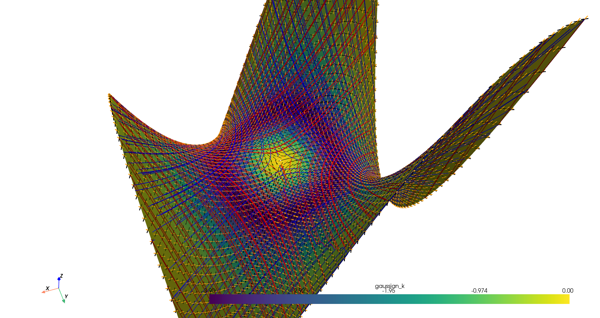
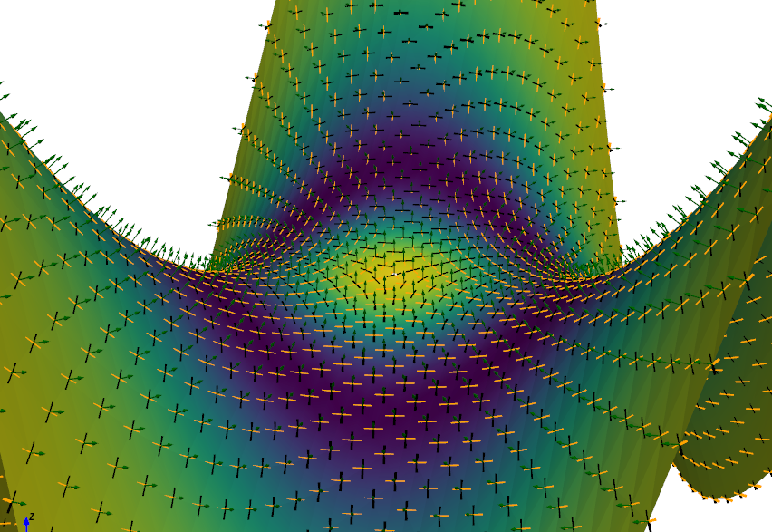

# Shape Viewer
By Sam Ehrenstein (ehrensam@cs.unc.edu)

This is my attempt at creating a 2020s-era version of [Shapemonger](https://andrewthall.org/papers/draft7_7Feb05.pdf), a Windows program for visualizing shapes and their geometric surface properties. I mainly built it on top of Numpy, PyVista, and SymPy (for symbolic calculations).

## Capabilities
Present capabilities include:
- display arbitrary functions of the form $z = f(x,y)$
- plot principal directions, normals, and asymptotic directions and curves
- fully configurable plot options

### Example screenshots



## Installation
In addition to Python 3.10 or later, Shape Viewer requiries these additional librariies:
```
numpy
scipy
matplotlib
pyvista
pyyaml
sympy
einops
```
All can be installed using `pip`.

## Usage
Shape Viewer creates PyVista plots based on YAML config files. Some example files are included in the `shapes/` directory. For example, in order to plot a [monkey saddle](https://mathworld.wolfram.com/MonkeySaddle.html), the following command is used:

```
python viewer.py shapes/monkeysaddle.yaml
```

### Config file structure
A typical config file looks like this:
```
# Monkey saddle
---
surface:
  equation: x**3 - 3*x*y**2
  scalars: gaussian_k
lims:
  xmin: -1
  xmax: 1
  ymin: -1
  ymax: 1
  steps: 91
normals:
  plot: False
  color: "green"
principal_dirs:
  plot: False
  colors: ["black", "orange"]
  draw_curves: False
asymptotic_dirs:
  plot: False
  colors: ["red", "blue"]
  draw_curves: True
other_maps:
  gaussmap: False
  asymptotic_spherical_map: False
  parabolic_curves: True
  ridges: False
  flecnodes: False
```
- `surface` describes the surface to plot.
  - `equation` is any sympy-parseable expression string, assumed to represent $f(x,y)$ in an equation for a surface of the form $z=f(x,y)$.
  - `scalars` describes which pointwise scalar value will be used to color the surface. Current options are `gaussian_k` for Gaussian curvature, `mean_k` for mean curvature, `k1` and `k2` for principal curvatures, and `shape_index` for shape index.
- `lims` controls the limits of the plotted surface.
- `normals` controls plotting of normals.
  - `plot` controls whether normals are plotted (as arrows).
  - if `plot` is True, `color` sets the color of the arrows. 
- `principal_dirs` and `asymptotic_dirs` control the plotting of principal and asymptotic directions at points.
  - `plot` controls whether the directions are plotted as arrows. Default is `False`.
  - `draw_curves` controls whether curves are plotted by integrating the fields of principal and asymptotic directions. It is not mutually exclusive with `plot`. Default is `False`.
  - `colors` is list of two colors, controlling the color of the arrows or curves draw. Default is `["black", "orange"]` for `principal_dirs` and `["red", "blue"]` for `asymptotic_dirs`.
- `other_maps` are various other plotting options, including Gaussian and asymptotic spherical maps.
  - `asymptotic_spherical_map` and `gaussmap` control whether the corresponding map is plotted. It will be drawn in a separate window before the surface plot.
  - `parabolic_curves` controls whether parabolic curves are drawn on the surface.
  - `ridges` controls whether ridges (as defined by Koenderink) are drawn (experimental)
  - `flecnodes` controls whether flecnodes are drawn (experimental)